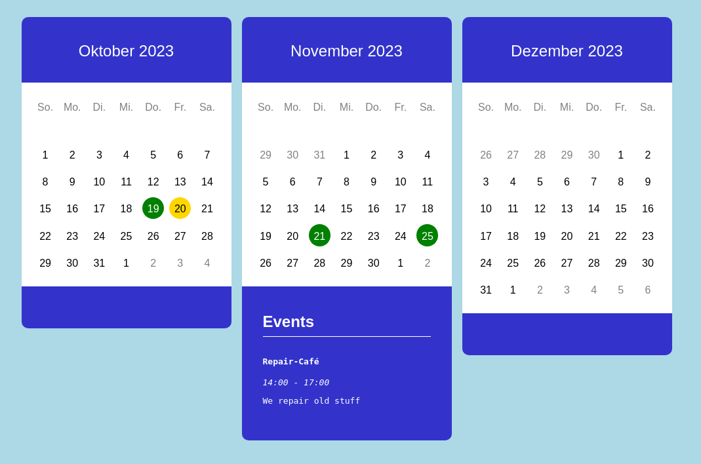

# This is a Web Component to display an Event Calendar

The `<schafferei-calendar />` web component is a configurable standalone javascript application which renders an event calendar on your web page.



When installed on your web page, you need access to the calendar configuration
file to edit the events at your wish.

This file doesn't need to be stored on your site. It can be publically available
at any readlable location on the internet like a cloud storage. 
The only thing you need is to garanty that you have write access to it.

All content and links provided in the calendar is rendered on-the-fly in the
web browser, therefore, search engine robots won't recognize and store it in 
their databases. **Be aware of this**.

As a consequence, all calendar data must also be rendered in the web server of your site by using the data from the calendar configuration file, that needs to be maintained by yourself and published on the same web page separately (or at any other location on your site).

## Necessary Files to Ship to Your Website

Three URLs must be provided to let the calendar work properly.

- The YAML calendar configuration files for each language \
    (for < schafferei-calendar />)
- The CSS bundle file \
    (for < schafferei-calendar />)
- The JavaScript module file \
    (for < script />)

Place these three files in a location, where it can be reached from the internet.

The calender configuration files must follow these file name convention:

    calendar.yml        for the default english language
    calendar.de.yaml    for any further optional language (here de)

Currently only the languages `en` *(default)* and `de` are supported.

## Where to Write These URLs?

```html
    <schafferei-calendar 
        num="3" 
        lang="de" 
        src="./calendar.yml" 
        css="./component/public/build/bundle.css"
        />
```

```html
    <!-- somewhere near the bottom of the body tag -->
    <script 
        src="./component/public/build/schafferei-calendar.js" 
        type="module"
    ></script>
```
## Configuration Options

< schafferei-calendar />

- `num` (optional, default = 1) \
  The amount of displayed successive months
- `lang` (optional, default = `en`) \
  The presentation language. Only supported: [`en`, `de`]
- `src` (required) \
  The URL to the YAML configuration file
- `css` (required) \
  The URL to the css bundle